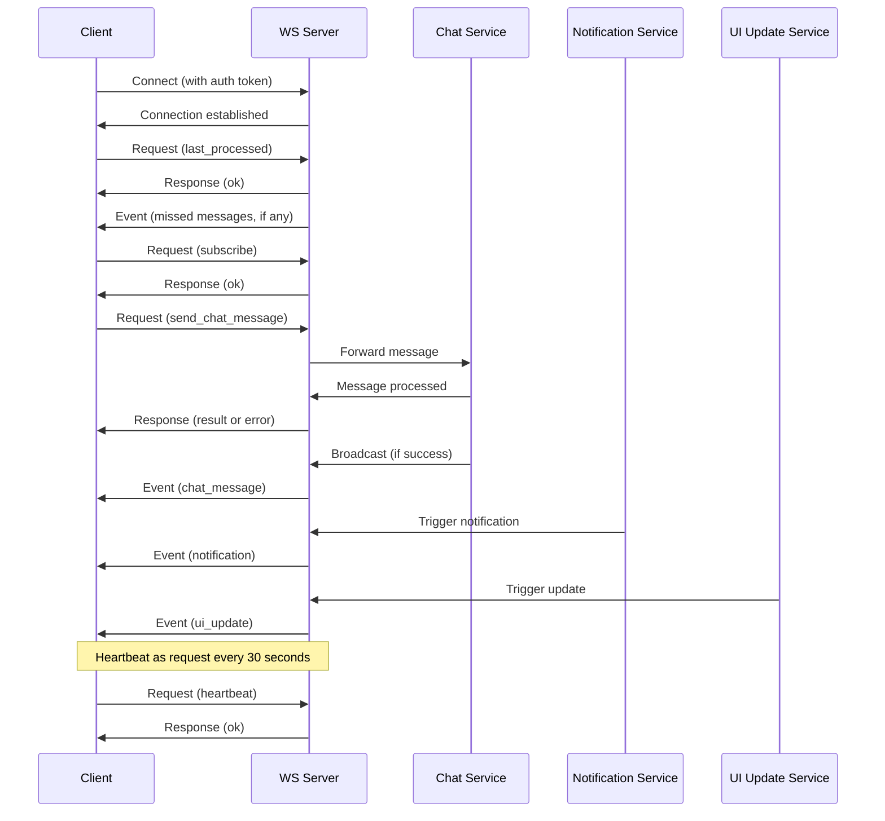

# WebSocket Architecture for Real-Time Chat and Updates in SvelteKit

## Overview

This document outlines the architecture for implementing a real-time chat system with UI updates and in-app push notifications using a single WebSocket connection in a server-side rendered (SSR) SvelteKit application. The design emphasizes resilience, ensuring at least once delivery of messages and correct ordering.

The architecture uses a single WebSocket connection per client to multiplex different types of real-time communications: request-response operations (e.g., sending chat messages, subscribing to channels) and server-initiated events (e.g., incoming chat messages, UI updates, push notifications). Messages are JSON-formatted and categorized into requests (client-to-server with IDs expecting responses) and events/responses (server-to-client).

## Message Types

### Client to Server: Requests

All client-to-server messages are requests with a unique ID, expecting a corresponding response from the server.

1. **Request** (`type: "request"`)
   - `id`: string (unique request ID generated by client)
   - `method`: string (e.g., "send_chat_message", "subscribe", "unsubscribe", "heartbeat", "last_processed")
   - `params`: object (method-specific parameters)

   Example methods and params:
   - `send_chat_message`: { `clientMessageId`: string, `chatId`: string, `content`: string, `timestamp`: number }
   - `subscribe`: { `channels`: [{ `name`: string, `lastMessageId`?: string }] } (array of channels with optional last known message ID for recovery)
   - `unsubscribe`: { `channels`: string[] }
   - `heartbeat`: { `timestamp`: number }
   - `last_processed`: { `messageId`: string }

### Server to Client: Responses and Events

Server-to-client messages are either responses to requests or unsolicited events.

1. **Response** (`type: "response"`)
   - `id`: string (matches the request ID)
   - `result`?: object (success result, method-specific)
   - `error`?: object (error details if failed, e.g., { `code`: string, `message`: string })

   Example results:
   - For `send_chat_message`: { `serverMessageId`: string }
   - For `subscribe`/`unsubscribe`: { `status`: "ok" }

2. **Event** (`type: "event"`)
   - `eventType`: string (e.g., "chat_message", "ui_update", "notification", "error")
   - `data`: object (event-specific data)

   Example eventTypes and data:
   - `chat_message`: { `id`: string, `chatId`: string, `senderId`: string, `content`: string, `timestamp`: number }
   - `ui_update`: { `id`: string, `updateType`: string, `data`: object, `timestamp`: number }
   - `notification`: { `id`: string, `title`: string, `body`: string, `data`: object, `timestamp`: number }
   - `logout`: { `userId`: string, `reason`?: string, `timestamp`: number }
   - `error`: { `code`: string, `message`: string, `timestamp`: number }

### Scenarios for Proactive Error Events

The server sends "error" events proactively (not as responses to requests) in the following scenarios:

- **Rate Limiting**: When a client exceeds message send limits, the server sends an error event (e.g., code: "RATE_LIMIT_EXCEEDED") to notify the client without terminating the connection immediately.
- **Session Issues**: If the user's session expires or authentication becomes invalid during the connection, an error event (e.g., code: "SESSION_EXPIRED") is sent, prompting the client to re-authenticate.
- **Server Overload**: During high load, the server may send error events (e.g., code: "SERVER_OVERLOAD") to inform clients of temporary issues.
- **User Bans or Restrictions**: If a user is banned or restricted mid-session, an error event (e.g., code: "USER_BANNED") notifies the client.
- **Maintenance or Shutdown**: Before planned maintenance or server shutdown, error events (e.g., code: "MAINTENANCE") are sent to all connected clients.
- **Protocol Violations**: If the client sends malformed messages repeatedly, an error event (e.g., code: "PROTOCOL_ERROR") is sent as a warning.

These events allow the client to handle errors gracefully, such as displaying notifications or initiating reconnection, without relying solely on connection termination. (proactive server errors, e.g., rate limiting, session issues)

## Data Flow

The following diagram illustrates the high-level data flow:

## Resilience Mechanisms

### At Least Once Delivery

- On connection establishment, the client sends a "last_processed" request to recover missed events.
- The server resends any missed events since that point.
- Client-side deduplication using event IDs prevents processing duplicate events.
- If event validation fails on the client, the connection is terminated, and reconnection triggers recovery.
- For requests, the client waits for a response with a timeout (e.g., 10 seconds). If no response or an error response, treat the operation as failed.

### Correct Ordering

- WebSocket protocol guarantees message delivery in the order sent by the server.
- No additional client-side ordering mechanisms are required.

### Connection Resilience

- Automatic reconnection with exponential backoff on disconnection.
- On reconnection, the client provides the last processed message ID for recovery.
- Server buffers recent messages to handle reconnections efficiently.

## Best Practices

1. **Authentication**: Use JWT tokens or similar for WebSocket authentication. Include auth token in connection URL or initial message.

2. **Message Validation**: Validate all incoming messages on both client and server sides.

3. **Rate Limiting**: Implement rate limiting to prevent abuse and ensure fair resource usage.

4. **Compression**: Use WebSocket compression (permessage-deflate) for large messages.

5. **Monitoring**: Log connection events, message throughput, and error rates for debugging.

6. **Graceful Degradation**: Fall back to polling if WebSocket fails completely.

7. **Security**: Use WSS (WebSocket Secure) in production. Validate origins and implement proper CORS.

8. **Scalability**: Use a message broker (e.g., Redis pub/sub) for horizontal scaling of WebSocket servers.

## Common Pitfalls

1. **Not Handling Reconnections**: Failing to implement reconnection logic leads to lost connections and poor user experience.

2. **Not Tracking Last Processed Event**: Forgetting to send the last processed event ID on reconnect can result in missed events.

3. **Ignoring Deduplication**: Resent events on reconnect must be deduplicated to avoid processing duplicates.

4. **Not Handling Response Timeouts**: For requests, implement timeouts to detect failures if no response is received.

5. **Blocking Operations**: Avoid long-running operations in WebSocket event handlers to prevent blocking the connection.

5. **Memory Leaks**: Properly clean up event listeners and message buffers to prevent memory leaks.

6. **Race Conditions**: Use proper synchronization when handling concurrent messages and state updates.

7. **Not Considering Mobile**: Mobile networks have higher latency and connection instability; design with this in mind.

8. **Overloading a Single Connection**: While using one WS is good, ensure the message volume doesn't overwhelm the connection or client processing.

## Implementation Considerations for SvelteKit

- Use Svelte stores for managing WebSocket state, pending requests, and event queues.
- Implement WebSocket logic in a Svelte component or store that persists across page navigations.
- Handle SSR carefully: WebSocket connections should only be established on the client side.
- Use SvelteKit's `onMount` and `onDestroy` for connection lifecycle management.
- Maintain a map of request IDs to promises for handling asynchronous request-response operations.
- Process events reactively to update the UI state.
- Consider using a WebSocket library like `reconnecting-websocket` for automatic reconnection handling.